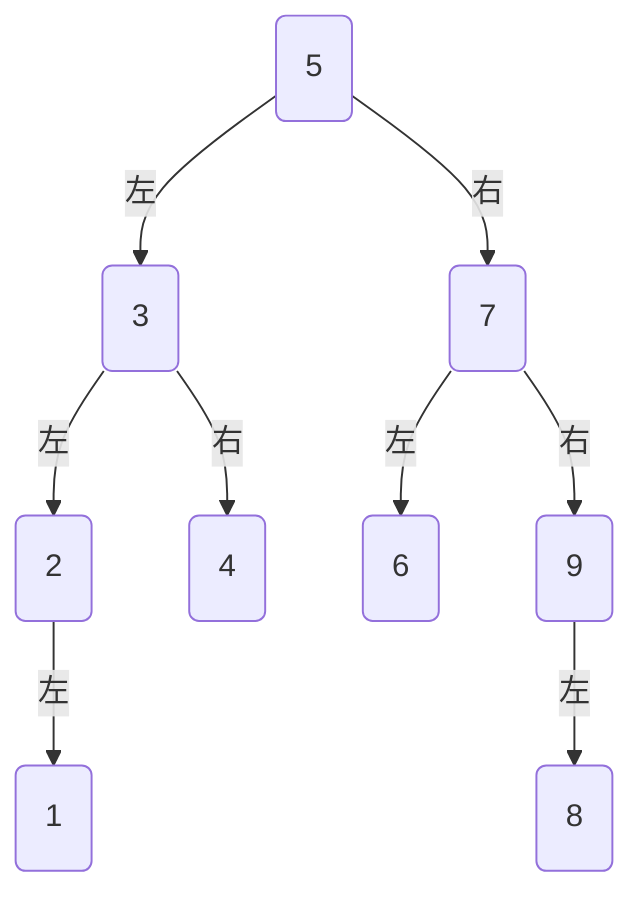
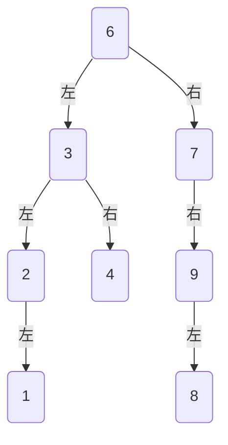

> BST 概念与操作详解：[Ch.4 L1 笔记](../note/ch04-trees.md#l1-树的初步与二叉搜索树4143-pp121142)

## 插入

```mermaid
graph TD
    N5(5) -->|左| N3(3)
    N5 -->|右| N7(7)
    N3 -->|左| N2(2)
    N3 -->|右| N4(4)
    N2 -->|左| N1(1)
    N7 -->|左| N6(6)
    N7 -->|右| N9(9)
    N9 -->|左| N8(8)
```

## 删除 5

```mermaid
graph TD
    N6(6) -->|左| N3(3)
    N6 -->|右| N7(7)
    N3 -->|左| N2(2)
    N3 -->|右| N4(4)
    N2 -->|左| N1(1)
    N7 -->|右| N9(9)
    N9 -->|左| N8(8)
```
