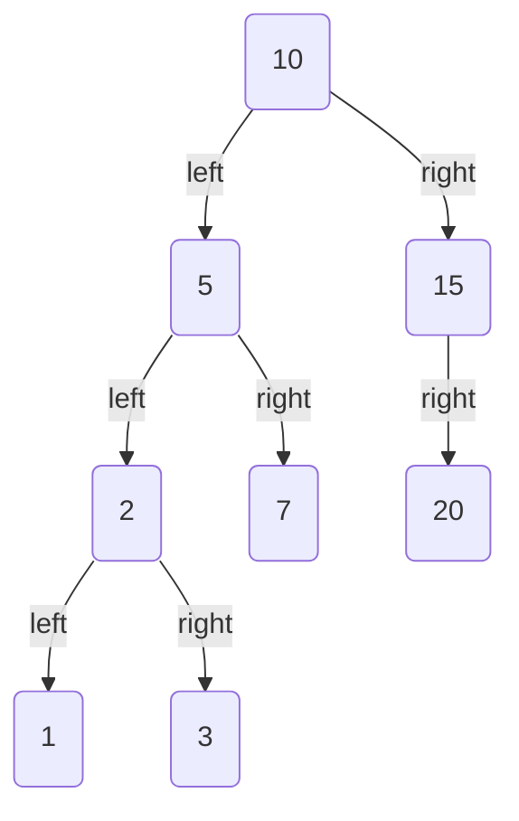
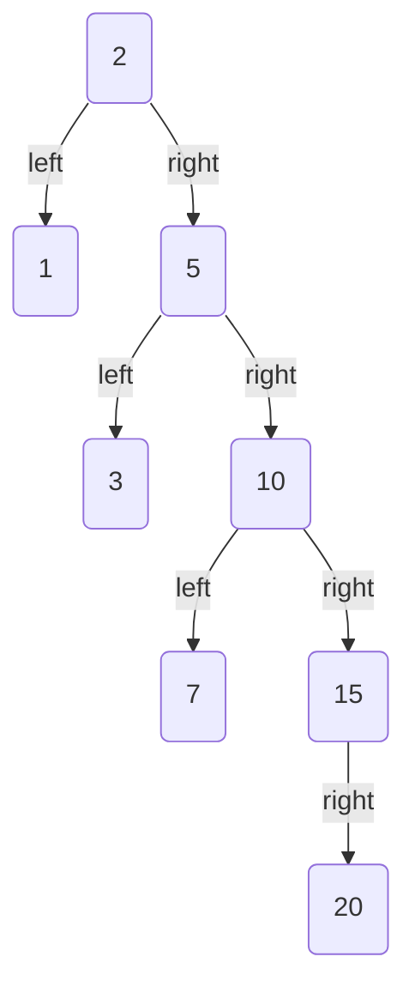
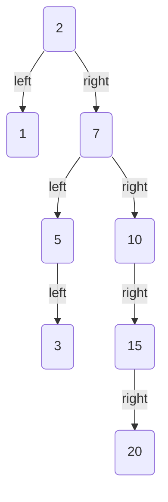
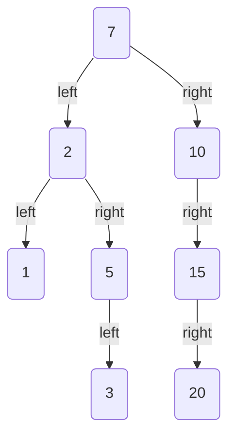

```mermaid
graph TD
    N10(10)-->|left|N5(5)
    N10-->|right|N15(15)
    N5-->|left|N2(2)
    N5-->|right|N7(7)
    N2-->|left|N1(1)
    N2-->|right|N3(3)
    N15-->|right|N20(20)
```

Find(2) (zig-zig)

```mermaid
graph TD
    N2(2)-->|left|N1(1)
    N2(2)-->|right|N5(5)
    N5-->|left|N3(3)
    N5-->|right|N10(10)
    N10-->|left|N7(7)
    N10-->|right|N15(15)
    N15-->|right|N20(20)
```

Find(9) 

(zig-zag)

```mermaid
graph TD
    N2(2)-->|left|N1(1)
    N2-->|right|N7(7)
    N7-->|left|N5(5)
    N7-->|right|N10(10)
    N5-->|left|N3(3)
    N10-->|right|N15(15)
    N15-->|right|N20(20)
```

(just rotate with root)

```mermaid
graph TD
    N7(7)-->|left|N2(2)
    N7-->|right|N10(10)
    N2-->|left|N1(1)
    N2-->|right|N5(5)
    N5-->|left|N3(3)
    N10-->|right|N15(15)
    N15-->|right|N20(20)
```
